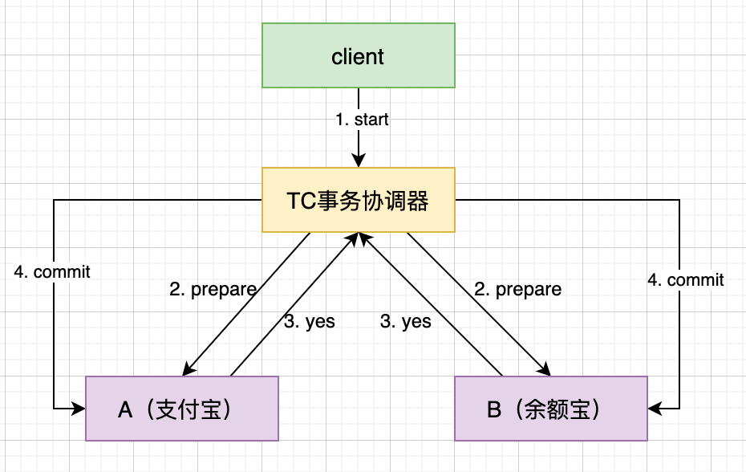
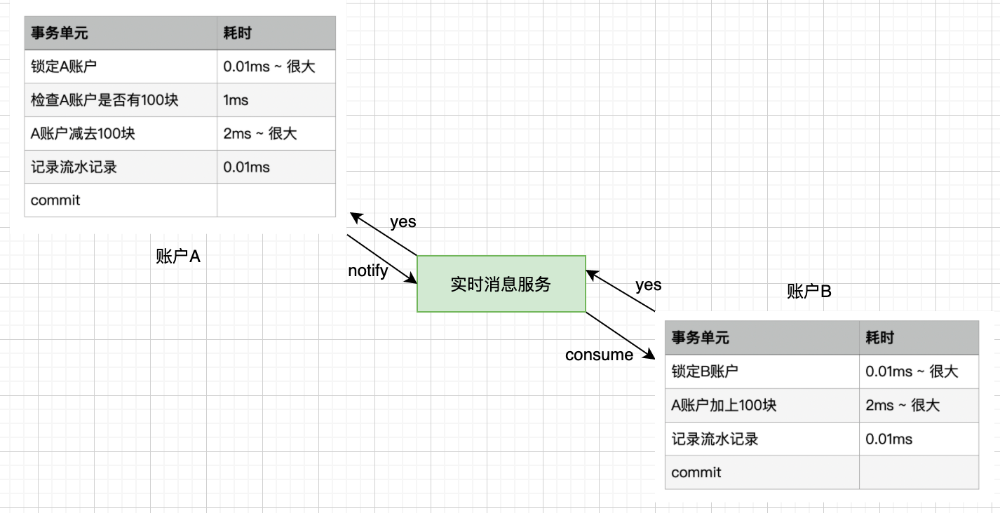
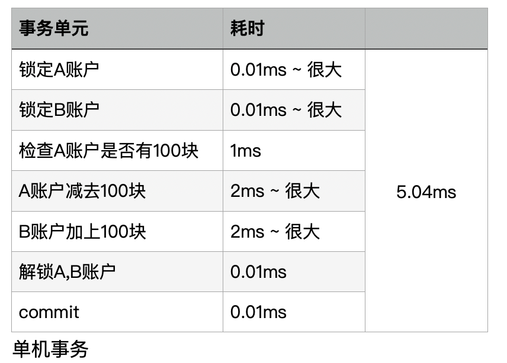
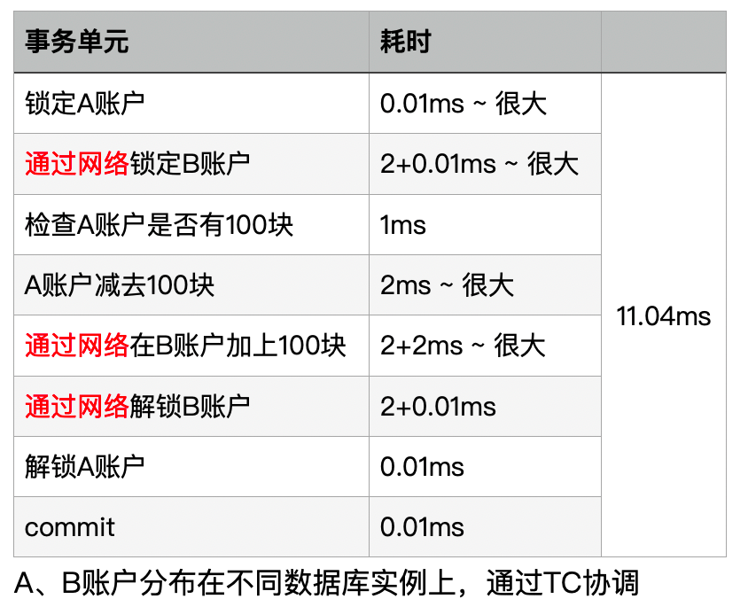
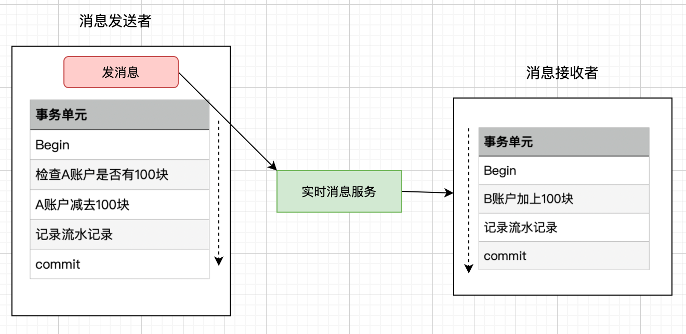
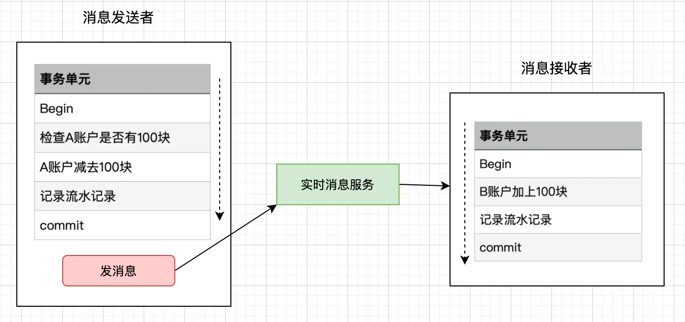
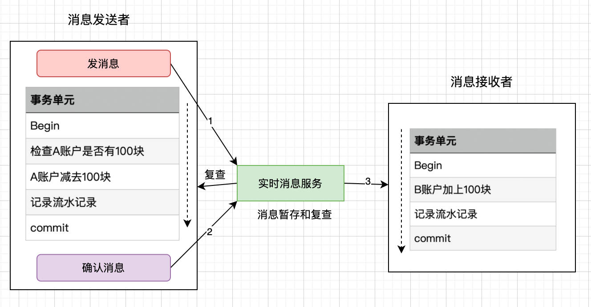
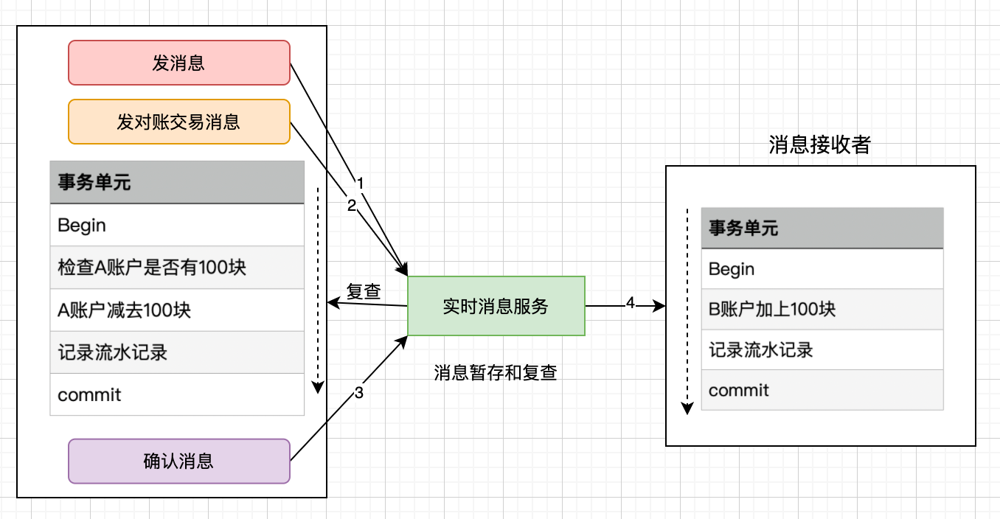
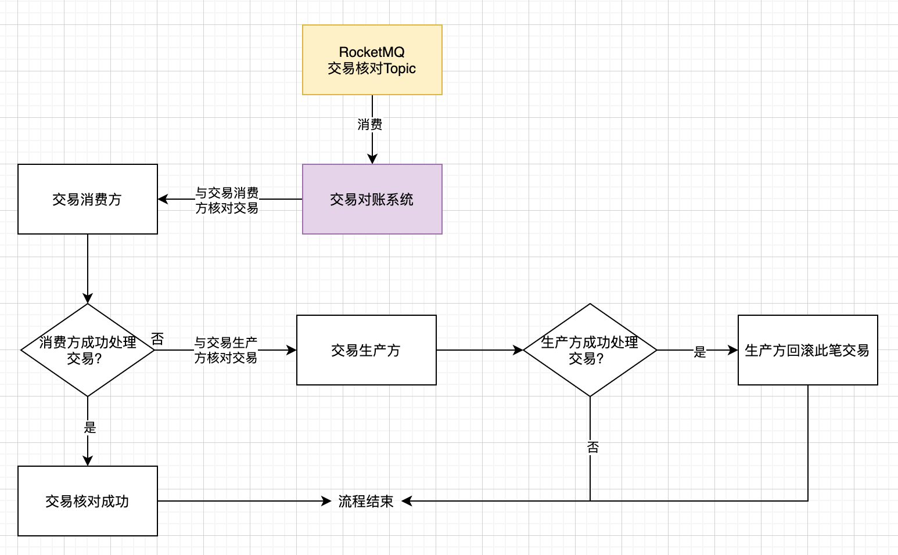

# RocketMQ消息机制如何处理分布式事务


## 1. 转账事务介绍

我们经常支付宝转账余额宝，这是日常生活的一件普通小事，但是我们思考支付宝扣除转账的钱之后，如果系统挂掉怎么办，这时余额宝账户并没有增加相应的金额，数据就会出现不一致状况了。

上述场景在各个类型的系统中都能找到相似影子，比如在电商系统中，当有用户下单后，除了在订单表插入一条记录外，对应商品表的这个商品数量必须减1吧，怎么保证？！在搜索广告系统中，当用户点击某广告后，除了在点击事件表中增加一条记录外，还得去商家账户表中找到这个商家并扣除广告费吧，怎么保证？！等等，相信大家或多或多少都能碰到相似情景。

**本质上问题可以抽象为：当一个表数据更新后，怎么保证另一个表的数据也必须要更新成功。**

如果是单机系统(数据库实例也在同一个系统上)的话，我们可以用**本地事务**轻松解决：

```mysql
Begin transaction 
  update A set amount=amount-10000 where userId=1;
  update B set amount=amount+10000 where userId=1;
End transaction 
commit;
```

这样确实能解决，如果你使用spring的话一个注解就能搞定上述事务功能。

```java
@Transactional(rollbackFor=Exception.class) 
public void update() { 
      // 更新A表 
      updateATable();
      // 更新B表
      updateBTable();
}
```

但在极端环境下也会出现问题，如A和B互相转账，一个事务锁住了A表，另一个事务锁住了B表，互相又在分别等待锁B表A表，这样就出现了死锁的情况，但是比较极端。

如果系统规模较小，数据表都在一个数据库实例上，上述本地事务方式可以很好地运行，但是如果系统规模较大，比如支付宝账户表和余额宝账户表显然不会在同一个数据库实例上，他们往往分布在不同的物理节点上，这时本地事务已经失去用武之地。

下面我们来看看比较主流的两种方案：


## 2. 分布式事务--2PC提交

两阶段提交协议（Two-phase Commit，2PC）经常被用来实现分布式事务。一般分为协调器TC和若干事务执行者两种角色，这里的事务执行者就是具体的数据库，协调器可以和事务执行器在一台机器上。



我们根据上面的图来看看主要流程：

1. client 发起一个开始请求到TC；

2. TC先将**prepare消息**写到本地日志，之后向所有的DB发起prepare消息。以支付宝转账到余额宝为例，TC给A的prepare消息是通知支付宝数据库相应账目扣款1万，TC给B的prepare消息是通知余额宝数据库相应账目增加1w。

   为什么在执行任务前需要先写本地日志，主要是为了故障后恢复用，本地日志起到现实生活中凭证的效果，如果没有本地日志（凭证），出问题容易死无对证；

3. 收到prepare消息后，执行具体本机事务，但不会进行commit，如果成功返回yes。同理，返回前都应把要返回的消息写到日志里，当作凭证。

4. TC收集所有执行器返回的消息，如果所有执行器都返回yes，那么给所有执行器发生送commit消息，执行器收到commit后执行本地事务的commit操作；如果有任一个执行器返回no，那么给所有执行器发送abort消息，执行器收到abort消息后执行事务abort操作。

> 注：把发送或接收到的消息先写到日志里，主要是为了故障后恢复用。如从故障中恢复后，先检查本机的日志。

现如今实现基于两阶段提交的分布式事务也没那么困难了，如果使用java，那么可以使用开源软件atomikos

不过但凡使用过的上述两阶段提交的同学都可以发现性能实在是太差，根本不适合高并发的系统。为什么？

* 两阶段提交涉及多次节点间的网络通信，通信时间太长！
* 事务时间相对于变长了，锁定的资源的时间也变长了，造成资源等待时间也增加好多！

正是由于分布式事务存在很严重的性能问题，大部分高并发服务都在避免使用，往往通过其他途径来解决数据一致性问题。


## 3. RocketMQ实现事务解耦

如果仔细观察生活的话，生活的很多场景已经给了我们提示。

比如在点餐并付了钱后，他们并不会直接把你点的炒肝给你，而是给你一张小票，然后让你拿着小票到出货区排队去取。为什么他们要将付钱和取货两个动作分开呢？原因很多，其中一个很重要的原因是为了使他们接待能力增强（并发量更高）。

同理转账服务也是如此，当支付宝账户扣除1万后，我们只要**生成一个凭证**（消息）即可，这个凭证（消息）上写着“让余额宝账户增加1万”，只要这个凭证（消息）能可靠保存，我们最终是可以拿着这个凭证（消息）让余额宝账户增加1万的，即我们能依靠这个凭证（消息）完成**最终一致性**。


**大事务 = 小事务 + 异步**

将大事务拆分成多个小事务异步执行。这样基本上能够将跨机事务的执行效率优化到与单机一致。转账的事务就可以分解成如下两个小事务：



### 3.1 业务与消息耦合的方式

完成扣款的同时，同时记录消息流水信息，这个流水信息与业务数据保存在**同一数据库实例**里（消息记录表表名为message）

```mysql
Begin transaction 
	update A set amount=amount-10000 where userId=1; 
	insert into message(userId, amount, status) values(1, 10000, 1); 
End transaction 
commit;
```

上述事务能保证只要支付宝账户里被扣了钱，消息一定能保存下来。当提交成功后，我们通过**实时消息服务**将此消息通知余额宝，余额宝查流水并处理成功后回复成功消息，支付宝收到回复后修改流水信息状态。失败的可以统一对账流水数据，实现回滚。


### 3.2 业务与消息解耦的方式

上述保存消息的方式使得流水信息和业务数据紧耦合在一起，从架构上看不够优雅，而且容易诱发其他问题。为了解耦，可以采用以下方式。

1. 支付宝在扣款事务提交之前，向实时消息服务请求发送消息，实时消息服务只记录消息数据，而不真正发送，只有消息发送成功后才会提交事务；

2. 当支付宝扣款事务被提交成功后，向实时消息服务确认发送。只有在得到确认发送指令后，实时消息服务才真正发送该消息；

   当支付宝扣款事务提交失败回滚后，向实时消息服务取消发送。在得到取消发送指令后，该消息将不会被发送；

3. 对于那些未确认的消息或者取消的消息，需要有一个消息状态确认系统定时去支付宝系统查询这个消息的状态并进行更新。为什么需要这一步骤，举个例子：假设在第2步支付宝扣款事务被成功提交后，系统挂了，此时消息状态并未被更新为“确认发送”，从而导致消息不能被发送。


优点：**消息数据独立存储**，降低业务系统与消息系统间的耦合； 

缺点：一次消息发送需要两次请求；业务处理服务需要实现消息状态回查接口。


## 4. 如何解决消息重复投递的问题？

为什么相同的消息会被重复投递？

> 比如余额宝处理完消息msg后，发送了处理成功的消息给支付宝，正常情况下RocketMQ要删除消息msg，但如果支付宝这时候悲剧的挂了，重启后一看消息msg还在，就会继续发送消息msg。

解决方法很简单，在余额宝这边增加消息应用状态表（message_apply），通俗来说就是个账本，用于记录消息的消费情况，每次来一个消息，在真正执行之前，先去消息应用状态表中查询一遍，如果找到说明是重复消息，丢弃即可，如果没找到才执行，同时插入到消息应用状态表（同一事务）。

伪代码表示

```mysql
For each msg in queue 
 Begin transaction 
   select count(*) as cnt from message_apply where msg_id=msg.msg_id; 
   if cnt==0 then 
      update B set amount=amount+10000 where userId=1; 
      insert into message_apply(msg_id) values(msg.msg_id); 
   end if
 End transaction 
 commit;
End For

```


## 5. 总结一下演进路线

比如，A向B转账100块。

在单机环境下，执行事务的情况，大概是下面这个样子：




当用户增长到一定程度，A和B的账户及余额信息已经不在同一台服务器上了，那么上面的流程就变成了这样：



这时候你会发现，同样是一个转账的业务，在集群环境下，耗时居然成倍的增长，这显然是不能够接受的。那如何来规避这个问题？

将大事务拆分成多个小事务异步执行。这样基本上能够将跨机事务的执行效率优化到与单机一致。转账的事务就可以分解成如下两个小事务：


图中执行本地事务（A账户扣款）和发送异步消息应该保证同时成功或者同时失败，也就是扣款成功了，发送消息一定要成功，如果扣款失败了，就不能再发送消息。那问题是：我们是先扣款还是先发送消息呢？



如果消息发送成功，但是扣款失败，消费端就会消费此消息，进而向B账户加钱。



如果扣款成功，发送消息失败，就会出现A扣钱了，但是B账户未加钱。


RocketMQ支持事务消息，下面来看看**RocketMQ是怎样来实现**的？



RocketMQ第一阶段发送Prepared消息时，会拿到消息的地址，第二阶段执行本地事物，第三阶段通过第一阶段拿到的地址去访问消息，并修改消息的状态。

如果确认消息发送失败了怎么办？

RocketMQ会定期扫描消息集群中的事物消息，如果发现了Prepared消息，它会向消息发送端(生产者)回查确认，Bob的钱到底是减了还是没减呢？如果减了是回滚还是继续发送确认消息呢？

RocketMQ会根据发送端设置的策略来决定是回滚还是继续发送确认消息。这样就保证了消息发送与本地事务同时成功或同时失败。


## 6. Rocket事务流程处理分析

挖坑


## 7. 交易事务示例

挖坑


## 8. 如何保证扣钱与加钱的事务的最终一致性

在上面的转账交易逻辑中，存在两个问题：

1. 如果没有使用RocketMQ的企业版本，那就可能会发生扣钱的事务成功了，但是扣钱的消息由于生产方发生了故障，导致交易消息没有在扣钱的事务提交成功后往RocketMQ中确认该条消息可以被提交，就会导致该条消息不会递交给消费方，导致Bob的钱被扣了，但是Smith的钱却没有增加。

2. 生产方的全部逻辑都处理完成了，扣钱的事务在数据库中被成功的提交，扣钱的消息在RocketMQ被成功的确认，但是消费方在消费消息的时候，自己本身发生了故障，或者处理该条消息发生了逻辑错误，导致B的钱没有被正确的加上。

以上两个问题虽然发生的机率都很低，但是只要存在着发生的机率就会一定在某个时间点发生，只是故障发生时间点的早晚问题。在金融系统中，每日都会跑系统日志执行对账操作，用于核对当日总共的支付与收入是否是平衡的、每个单笔交易结果是否都满足借贷平衡等，因而为了避免以上两个问题的发生，我的处理方式还是引入金融系统对账的业务逻辑来进行处理。




在发送交易事务消息过后，发送一个交易对账消息到对账Topic中，该对账消息为非事务消息，发送成功即表示成功保存到了RocketMQ中，该交易对账消息不会用于消费者消费，后续的交易对账系统会消费该队列中的对账信息，其分别会和交易的生产方和消费方进行交易核对，核对逻辑如下：



