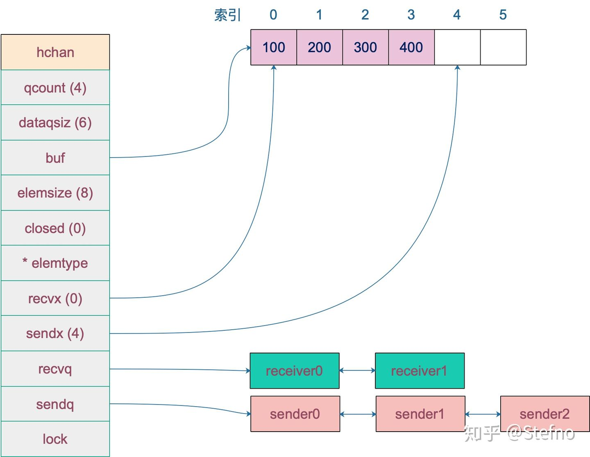

> 参考 https://zhuanlan.zhihu.com/p/74613114

## channel 实现原理

* 对chan的接收和发送都会在编译期间转换成为底层的发送接收函数。
* channel 分为两种：带缓冲、不带缓冲。对不带缓冲的 channel 进行的操作实际上可以看作“同步模式”，带缓冲的则称为“异步模式”。
* 同步模式下，发送接收方都要都要同步就绪，只有在双方都处于ready状态，数据才能在两者之间传输（实际上是内存拷贝）。否则，任意一方都会被挂起，等待另一方来唤醒。
* 异步模式下，在缓冲区有剩余槽位时（有剩余容量），发送接收操作能顺利执行，不会被阻塞以致挂起。否则，操作的一方（如写入）同样会被挂起，直到出现相反操作（如接收）才会被唤醒。


## chan 数据结构

```go
type hchan struct {
    // chan 里元素数量
    qcount   uint
    // chan 底层循环数组的长度
    dataqsiz uint
    // 指向底层循环数组的指针
    // 只针对有缓冲的 channel
    buf      unsafe.Pointer
    // chan 中元素大小
    elemsize uint16
    // chan 是否被关闭的标志
    closed   uint32
    // chan 中元素类型
    elemtype *_type // element type
    
    // 已发送元素在循环数组中的索引
    sendx    uint   // send index
    // 已接收元素在循环数组中的索引
    recvx    uint   // receive index
    
    // 等待接收的 goroutine 队列
    recvq    waitq  // list of recv waiters
    // 等待发送的 goroutine 队列
    sendq    waitq  // list of send waiters

    // 保护 hchan 中所有字段
    lock mutex
}
```

* `buf` 指向底层循环数组，只有缓冲型的 channel 才有。
* `lock` 用来保证每个读 channel 或写 channel 的操作都是原子的。

* `sendx`，`recvx` 均指向底层循环数组，表示当前可以发送和接收的元素位置索引值（相对于底层数组）。

* `sendq`，`recvq` 分别表示被阻塞的 goroutine，这些 goroutine 由于尝试读取 channel 或向 channel 发送数据而被阻塞。

```go
type waitq struct {
	first *sudog
	last  *sudog
}
```

`waitq` 是 `sudog` 的一个双向链表，而 `sudog` 实际上是对 goroutine 的一个封装。





## 操作方法实现


### make

```go
const hchanSize = unsafe.Sizeof(hchan{}) + uintptr(-int(unsafe.Sizeof(hchan{}))&(maxAlign-1))

func makechan(t *chantype, size int64) *hchan {
    elem := t.elem

    // 省略了检查 channel size，align 的代码
    // ……

    var c *hchan
    // 如果元素类型不含指针 或者 size 大小为 0（无缓冲类型）
    // 只进行一次内存分配
    if elem.kind&kindNoPointers != 0 || size == 0 {
        // 如果 hchan 结构体中不含指针，GC 就不会扫描 chan 中的元素
        // 只分配 "hchan 结构体大小 + 元素大小*个数" 的内存
        c = (*hchan)(mallocgc(hchanSize+uintptr(size)*elem.size, nil, true))
        // 如果是缓冲型 channel 且元素大小不等于 0（大小等于 0的元素类型：struct{}）
        if size > 0 && elem.size != 0 {
            c.buf = add(unsafe.Pointer(c), hchanSize)
        } else {
            // race detector uses this location for synchronization
            // Also prevents us from pointing beyond the allocation (see issue 9401).
            // 1. 非缓冲型的，buf 没用，直接指向 chan 起始地址处
            // 2. 缓冲型的，能进入到这里，说明元素无指针且元素类型为 struct{}，也无影响
            // 因为只会用到接收和发送游标，不会真正拷贝东西到 c.buf 处（这会覆盖 chan的内容）
            c.buf = unsafe.Pointer(c)
        }
    } else {
        // 进行两次内存分配操作
        c = new(hchan)
        c.buf = newarray(elem, int(size))
    }
    c.elemsize = uint16(elem.size)
    c.elemtype = elem
    // 循环数组长度
    c.dataqsiz = uint(size)

    // 返回 hchan 指针
    return c
}
```


### recv

```go
// entry points for <- c from compiled code
func chanrecv1(c *hchan, elem unsafe.Pointer) {
    chanrecv(c, elem, true)
}

func chanrecv2(c *hchan, elem unsafe.Pointer) (received bool) {
    _, received = chanrecv(c, elem, true)
    return
}
```

`chanrecv1` 函数处理不带 "ok" 的情形，`chanrecv2` 则通过返回 "received" 这个字段来反应 channel 是否被关闭。接收值则比较特殊，会“放到”参数 `elem` 所指向的地址了，这很像 C/C++ 里的写法。如果代码里忽略了接收值，这里的 elem 为 nil。

无论如何，最终转向了 `chanrecv` 函数：

```go
// 位于 src/runtime/chan.go

// chanrecv 函数接收 channel c 的元素并将其写入 ep 所指向的内存地址。
// 如果 ep 是 nil，说明忽略了接收值。
// 如果 block == false，即非阻塞型接收，在没有数据可接收的情况下，返回 (false, false)
// 否则，如果 c 处于关闭状态，将 ep 指向的地址清零，返回 (true, false)
// 否则，用返回值填充 ep 指向的内存地址。返回 (true, true)
// 如果 ep 非空，则应该指向堆或者函数调用者的栈

func chanrecv(c *hchan, ep unsafe.Pointer, block bool) (selected, received bool) {
    // 省略 debug 内容 …………

    // 如果是一个 nil 的 channel
    if c == nil {
        // 如果不阻塞，直接返回 (false, false)
        if !block {
            return
        }
        // 否则，接收一个 nil 的 channel，goroutine 挂起
        gopark(nil, nil, "chan receive (nil chan)", traceEvGoStop, 2)
        throw("unreachable") // 不会执行到这
    }

    // 非阻塞，buf没元素，
    if !block && empty(c) {
        // 未关闭，返回 (false, false)
        if atomic.Load(&c.closed) == 0 {
			return
		}
       	// 已关闭。 因为 channel 不可能被重复打开。
        // 它可能在上面的空检查和关闭检查之间到达，重新检查通道是否有待处理的数据接收，
        if empty(c) {
			if ep != nil {
                // 未忽略返回值，那么接收的值将是一个该类型的零值
                // typedmemclr 根据类型清理相应地址的内存，标为零值
				typedmemclr(c.elemtype, ep)
			}
			return true, false
		}
    }

    var t0 int64
    if blockprofilerate > 0 {
        t0 = cputicks()
    }

    // 加锁
    lock(&c.lock)

    // 已关闭 && 循环数组 buf 里没有元素
    // 这里可以处理 非缓冲型关闭 和 缓冲型 buf 无元素关闭 两种情况
    // 也就是说即使是关闭状态，但在缓冲型的 channel，buf 里有元素的情况下还能接收到元素
    if c.closed != 0 && c.qcount == 0 {
        if raceenabled {
            raceacquire(unsafe.Pointer(c))
        }
        // 解锁
        unlock(&c.lock)
        if ep != nil {
            // 从一个已关闭的并且空的 channel 执行接收操作，且未忽略返回值
            // 那么接收的值将是一个该类型的零值
            // typedmemclr 根据类型清理相应地址的内存，标为零值
            typedmemclr(c.elemtype, ep)
        }
        // 从一个已关闭的 channel 接收，selected 会返回true
        return true, false
    }

    // 等待发送队列里有 goroutine 存在，说明 buf 是满的
    // 这有可能是：
    // 1. 非缓冲型的 channel
    // 2. 缓冲型的 channel，但 buf 满了
    // 针对 1，直接进行内存拷贝（从 sender goroutine -> receiver goroutine）
    // 针对 2，接收到循环数组头部的元素，并将发送者的元素放到循环数组尾部
    if sg := c.sendq.dequeue(); sg != nil {
        // Found a waiting sender. If buffer is size 0, receive value
        // directly from sender. Otherwise, receive from head of queue
        // and add sender's value to the tail of the queue (both map to
        // the same buffer slot because the queue is full).
        recv(c, sg, ep, func() { unlock(&c.lock) }, 3)
        return true, true
    }
    
    // 下面逻辑是 没有阻塞在sendq 的 g

    // 缓冲型，buf 里有元素，可以正常接收
    if c.qcount > 0 {
        // 直接从循环数组里找到要接收的元素
        qp := chanbuf(c, c.recvx)

        // …………

        // 代码里，没有忽略要接收的值，不是 "<- ch"，而是 "val <- ch"，ep 指向 val
        if ep != nil {
            typedmemmove(c.elemtype, ep, qp)
        }
        // 清理掉循环数组里相应位置的值
        typedmemclr(c.elemtype, qp)
        // 接收游标向前移动
        c.recvx++
        // 接收游标归零
        if c.recvx == c.dataqsiz {
            c.recvx = 0
        }
        // buf 数组里的元素个数减 1
        c.qcount--
        // 解锁
        unlock(&c.lock)
        return true, true
    }

    if !block {
        // 非阻塞接收，解锁。selected 返回 false，因为没有接收到值
        unlock(&c.lock)
        return false, false
    }

    // 接下来就是要被阻塞接收的情况了
    // 构造一个 sudog
    gp := getg() 		   // p上运行的g
    mysg := acquireSudog() // 新创建的g
    mysg.releasetime = 0
    if t0 != 0 {
        mysg.releasetime = -1
    }

    // 待接收数据的地址保存下来
    mysg.elem = ep
    mysg.waitlink = nil
    gp.waiting = mysg
    mysg.g = gp
    mysg.selectdone = nil
    mysg.c = c
    gp.param = nil
    // 进入channel 的等待接收队列
    c.recvq.enqueue(mysg)
    // 将当前 goroutine 挂起
    goparkunlock(&c.lock, "chan receive", traceEvGoBlockRecv, 3)

    // 被唤醒了，接着从这里继续执行一些扫尾工作
    if mysg != gp.waiting {
        throw("G waiting list is corrupted")
    }
    gp.waiting = nil
    if mysg.releasetime > 0 {
        blockevent(mysg.releasetime-t0, 2)
    }
    closed := gp.param == nil
    gp.param = nil
    mysg.c = nil
    releaseSudog(mysg)
    return true, !closed
}
```


### send

```go
func chansend(c *hchan, ep unsafe.Pointer, block bool, callerpc uintptr) bool {
    if c == nil {
        // 不能阻塞，直接返回 false，表示未发送成功
        if !block {
            return false
        }
        // 当前 goroutine 被挂起
        gopark(nil, nil, "chan send (nil chan)", traceEvGoStop, 2)
        throw("unreachable")
    }

    // 省略 debug 相关……

    // 对于不阻塞的 send，快速检测失败场景
    //
    // 如果 channel 未关闭且 channel 没有多余的缓冲空间。这可能是：
    // 1. channel 是非缓冲型的，且等待接收队列里没有 goroutine
    // 2. channel 是缓冲型的，但循环数组已经装满了元素
    if !block && c.closed == 0 && ((c.dataqsiz == 0 && c.recvq.first == nil) ||
        (c.dataqsiz > 0 && c.qcount == c.dataqsiz)) {
        return false
    }

    var t0 int64
    if blockprofilerate > 0 {
        t0 = cputicks()
    }

    // 锁住 channel，并发安全
    lock(&c.lock)

    // 如果 channel 关闭了
    if c.closed != 0 {
        unlock(&c.lock)
        panic(plainError("send on closed channel"))
    }

    // 如果接收队列里有 goroutine，直接将要发送的数据拷贝到接收 goroutine
    if sg := c.recvq.dequeue(); sg != nil {
        send(c, sg, ep, func() { unlock(&c.lock) }, 3)
        return true
    }

    // 对于缓冲型的 channel，如果还有缓冲空间
    if c.qcount < c.dataqsiz {
        // qp 指向 buf 的 sendx 位置
        qp := chanbuf(c, c.sendx)

        // ……

        // 将数据从 ep 处拷贝到 qp
        typedmemmove(c.elemtype, qp, ep)
        // 发送游标值加 1
        c.sendx++
        // 如果发送游标值等于容量值，游标值归 0
        if c.sendx == c.dataqsiz {
            c.sendx = 0
        }
        // 缓冲区的元素数量加一
        c.qcount++

        unlock(&c.lock)
        return true
    }

    // 如果不需要阻塞，则直接返回错误
    if !block {
        unlock(&c.lock)
        return false
    }

    // channel 满了，发送方会被阻塞。接下来会构造一个 sudog

    // 获取当前 goroutine 的指针
    gp := getg()
    mysg := acquireSudog()
    mysg.releasetime = 0
    if t0 != 0 {
        mysg.releasetime = -1
    }

    mysg.elem = ep
    mysg.waitlink = nil
    mysg.g = gp
    mysg.selectdone = nil
    mysg.c = c
    gp.waiting = mysg
    gp.param = nil

    // 当前 goroutine 进入发送等待队列
    c.sendq.enqueue(mysg)

    // 当前 goroutine 被挂起
    goparkunlock(&c.lock, "chan send", traceEvGoBlockSend, 3)

    // 从这里开始被唤醒了（channel 有机会可以发送了）
    if mysg != gp.waiting {
        throw("G waiting list is corrupted")
    }
    gp.waiting = nil
    if gp.param == nil {
        if c.closed == 0 {
            throw("chansend: spurious wakeup")
        }
        // 被唤醒后，channel 关闭了。坑爹啊，panic
        panic(plainError("send on closed channel"))
    }
    gp.param = nil
    if mysg.releasetime > 0 {
        blockevent(mysg.releasetime-t0, 2)
    }
    // 去掉 mysg 上绑定的 channel
    mysg.c = nil
    releaseSudog(mysg)
    return true
}
```

- 如果检测到 channel 是nil的，当前 goroutine 会被挂起。
- 对于不阻塞的发送操作，如果 channel 未关闭并且没有多余的缓冲空间（说明：a. channel 是非缓冲型的，且等待接收队列里没有 goroutine；b. channel 是缓冲型的，但循环数组已经装满了元素），会返回false


### close

```go
func closechan(c *hchan) {
    // 关闭一个 nil channel，panic
    if c == nil {
        panic(plainError("close of nil channel"))
    }

    // 上锁
    lock(&c.lock)
    // 如果 channel 已经关闭
    if c.closed != 0 {
        unlock(&c.lock)
        // panic
        panic(plainError("close of closed channel"))
    }

    // …………

    // 修改关闭状态
    c.closed = 1

    var glist *g

    // 将 channel 所有等待接收队列的里 sudog 释放
    for {
        // 从接收队列里出队一个 sudog
        sg := c.recvq.dequeue()
        // 出队完毕，跳出循环
        if sg == nil {
            break
        }

        // 如果 elem 不为空，说明此 receiver 未忽略接收数据
        // 给它赋一个相应类型的零值
        if sg.elem != nil {
            typedmemclr(c.elemtype, sg.elem)
            sg.elem = nil
        }
        if sg.releasetime != 0 {
            sg.releasetime = cputicks()
        }
        // 取出 goroutine
        gp := sg.g
        gp.param = nil
        if raceenabled {
            raceacquireg(gp, unsafe.Pointer(c))
        }
        // 相连，形成链表
        gp.schedlink.set(glist)
        glist = gp
    }

    // 将 channel 等待发送队列里的 sudog 释放
    // 如果存在，这些 goroutine 将会 panic
    for {
        // 从发送队列里出队一个 sudog
        sg := c.sendq.dequeue()
        if sg == nil {
            break
        }

        // 发送者会 panic
        sg.elem = nil
        if sg.releasetime != 0 {
            sg.releasetime = cputicks()
        }
        gp := sg.g
        gp.param = nil
        if raceenabled {
            raceacquireg(gp, unsafe.Pointer(c))
        }
        // 形成链表
        gp.schedlink.set(glist)
        glist = gp
    }
    // 解锁
    unlock(&c.lock)

    // Ready all Gs now that we've dropped the channel lock.
    // 遍历链表
    for glist != nil {
        // 取最后一个
        gp := glist
        // 向前走一步，下一个唤醒的 g
        glist = glist.schedlink.ptr()
        gp.schedlink = 0
        // 唤醒相应 goroutine
        goready(gp, 3)
    }
}
```


