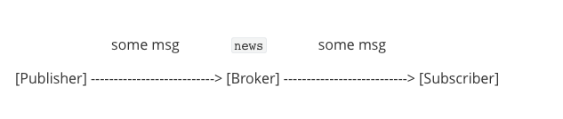

# MQTT协议设计规则

## 灵活的发布订阅主题设计

https://www.emqx.com/zh/blog/what-is-the-mqtt-protocol

- 发布者和消费者之间不必预先知道对方的存在，比如不需要预先沟通对方的 IP Address 和 Port
- 发布者和消费者之间不必同时运行。因为 Broker 是一直运行的。

在 MQTT 协议里，上面提到的 `过滤规则` 是 `Topic`。比如：所有发布到 `news` 这个 Topic 的消息，都会被 Broker 转发给已经订阅了 `news` 的订阅者:

上图中订阅者预先订阅了 `news`，然后发布者向 Broker 发布了一条消息 "some msg" 并指定发布到 `news` 主题，Broker 通过 Topic 匹配，决定将这条消息转发给订阅者。

MQTT 的 Topic 有层级结构，并且支持通配符 `+` 和 `#`:

- `+` 是匹配单层的通配符。比如 `news/+` 可以匹配 `news/sports`，`news/+/basketball` 可匹配到 `news/sports/basketball`。
- `#` 是一到多层的通配符。比如 `news/#` 可以匹配 `news`、 `news/sports`、`news/sports/basketball` 以及 `news/sports/basketball/x` 等等。

MQTT 的主题是不要预先创建的，发布者发送消息到某个主题、或者订阅者订阅某个主题的时候，Broker 就会自动创建这个主题。

## 带宽消耗最小化

MQTT 协议将协议本身占用的额外消耗最小化，消息头部最小只需要占用 2 个字节。

## 消息格式

MQTT 的消息格式分三部分，MQTT协议也是应用层协议，需要借助TCP/IP协议进行传输，类似HTTP协议。MQTT协议也有自己的格式，如下表：

*[ Fixed Header | Variable Header | Payload]*

* Fixed Header：固定头部，MQTT协议分很多种类型，如**连接，发布，订阅，心跳**等。其中固定头是必须的，所有类型的MQTT协议中，都必须包含固定头。

* Variable Header：可变头部，**可变头部不是可选的意思**，而是指这部分在有些协议类型中存在，在有些协议中不存在。

* Payload：消息载体，就是消息内容。与可变头一样，在有些协议类型中有消息内容，有些协议类型中没有消息内容。

### Fixed Header

Fixed Header中包含首字节，高4位用来表示报文类型，低4位用于类型控制。目前只有PUBLISH使用了类型控制字段。其它控制字段被保留并且必须与协议定义保持一致。

Fixed Header同时包含Remaining Length，这是剩余消息长度，**最大长度为4字节**，理论上一条MQTT最大可以传输**256MB**数据。Remaining Length=Variable Header+Payload长度。

固定头包含两部分内容，首字节(字节1)和剩余消息报文长度(1-4字节)。

| Bit       | 7         | 6       | 5      | 4    | 3                | 2         | 1              | 0             |
| --------- | --------- | ------- | ------ | ---- | ---------------- | --------- | -------------- | ------------- |
| Byte 1    | MQTT      | Control | Packet | type | *Flags specific* | *to each* | *MQTT Control* | *Packet type* |
| Byte 2... | Remaining | Length  |        |      |                  |           |                |               |

> 为了避免翻译不准确，这里都使用官方的原始术语。其中MQTT Control Packet type可以简单理解为字节位Bit[7-4]用于确定报文类型。Flags specific to each MQTT Control Packet type意思是字节位Bit[3-0]用作某些报文的特殊标记。

#### 首字节

首字节用于表示MQTT消息的报文类型以及某些类型的控制标记，如上图。高4位(bit7~bit4)表示协议类型，总共可以表示16种协议类型，其中0000和1111是保留字段。MQTT消息报文类型如下。

| 报文类型    | 字段值 | 数据方向           | 描述                     |
| ----------- | ------ | ------------------ | ------------------------ |
| 保留        | 0      | 禁用               | 保留                     |
| CONNECT     | 1      | Client ---> Server | 客户端连接到服务器       |
| CONNACK     | 2      | Server ---> Client | 连接确认                 |
| PUBLISH     | 3      | Client <--> Server | 发布消息                 |
| PUBACK      | 4      | Client <--> Server | 发不确认                 |
| PUBREC      | 5      | Client <--> Server | 消息已接收(QoS2第一阶段) |
| PUBREL      | 6      | Client <--> Server | 消息释放(QoS2第二阶段)   |
| PUBCOMP     | 7      | Client <--> Server | 发布结束(QoS2第三阶段)   |
| SUBSCRIBE   | 8      | Client ---> Server | 客户端订阅请求           |
| SUBACK      | 9      | Server ---> Client | 服务端订阅确认           |
| UNSUBACRIBE | 10     | Client ---> Server | 客户端取消订阅           |
| UNSUBACK    | 11     | Server ---> Client | 服务端取消订阅确认       |
| PINGREQ     | 12     | Client ---> Server | 客户端发送心跳           |
| PINGRESP    | 13     | Server ---> Client | 服务端回复心跳           |
| DISCONNECT  | 14     | Client ---> Server | 客户端断开连接请求       |
| 保留        | 15     | 禁用               | 保留                     |

首字节的低4位(bit3~bit0)用来表示某些报文类型的控制字段，实际上只有少数报文类型有控制位，如下图。

| 报文类型    | 固定头标记         | Bit 3 | Bit 2 | Bit 1 | Bit 0  |
| ----------- | ------------------ | ----- | ----- | ----- | ------ |
| CONNECT     | 保留               | 0     | 0     | 0     | 0      |
| CONNACK     | 保留               | 0     | 0     | 0     | 0      |
| PUBLISH     | Used in MQTT 3.1.1 | DUP   | QoS   | QoS   | RETAIN |
| PUBACK      | 保留               | 0     | 0     | 0     | 0      |
| PUBREC      | 保留               | 0     | 0     | 0     | 0      |
| PUBREL      | 保留               | 0     | 0     | 1     | 0      |
| PUBCOMP     | 保留               | 0     | 0     | 0     | 0      |
| SUBSCRIBE   | 保留               | 0     | 0     | 1     | 0      |
| SUBACK      | 保留               | 0     | 0     | 0     | 0      |
| UNSUBACRIBE | 保留               | 0     | 0     | 1     | 0      |
| UNSUBACK    | 保留               | 0     | 0     | 0     | 0      |
| PINGREQ     | 保留               | 0     | 0     | 0     | 0      |
| PINGRESP    | 保留               | 0     | 0     | 0     | 0      |
| DISCONNECT  | 保留               | 0     | 0     | 0     | 0      |

当发布PUBLISH消息时，如果DUP字段(bit 3)设置为1，表明这是一条重复消息，否则是第一次发布消息。为了保证消息的可靠性传递，当QoS设置为1时，客户端或服务器发布消息时，需要得到对方的确认(PUBACK)，如果一段时间后没收到PUBACK，那么会再次发送当前消息，并将DUP字段标记为1。

QoS用来表明QoS等级，如果Bit 1和Bit 2都为0，表示QoS 0。如果Bit 1为1，表示QoS 1。如果Bit 2为1，表示QoS 2。如果同时将Bit 1和Bit 2都设置成1，那么客户端或服务器认为这是一条非法的消息，会关闭当前连接。

目前Bit[3-0]只在PUBLISH协议中使用有效，并且表中指明了是**MQTT 3.1.1**版本。对于其它MQTT协议版本，内容可能不同。所有固定头标记为"保留"的协议类型，Bit[3-0]必须保持与表中保持一致，如SUBSCRIBE协议，其Bit 1必须为1。如果接收方接收到非法的消息，会强行关闭当前连接。

#### Remaining Length

Remaining Length意思是剩余长度，即Variable Header + Payload的长度。剩余长度从Byte 2开始，最长可达4字节。所以剩余长度范围是Byte[2-5]。那么怎样确定其长度到底是1还是4呢，这取决于字节的最高位Bit 7(默认都是高字节在前)，如果这个值是1，那么就继续计算字节长度，如果是0，那么就不再计算字节长度。

消息长度可以简单理解为128进制的数据，4位长度最大可以表示`128*128*128*128Byte=256MB`。但是这个长度的计算有些特别，就是低位在前，高位在后(因为正常的表示方法是高位在前，低位在后)，字节最高位Bit7用于标记是否需要继续计算消息长度。以下是消息长度的长度范围：

| 字节 | 最小值                             | 最大值                               |
| ---- | ---------------------------------- | ------------------------------------ |
| 1    | 0(0x00)                            | 127(0x7F)                            |
| 2    | 128 (0x80, 0x01)                   | 16 383 (0xFF, 0x7F)                  |
| 3    | 16 384 (0x80, 0x80, 0x01)          | 2 097 151 (0xFF, 0xFF, 0x7F)         |
| 4    | 2 097 152 (0x80, 0x80, 0x80, 0x01) | 268 435 455 (0xFF, 0xFF, 0xFF, 0x7F) |

稍微注意一下，0x80=1000 0000，不是 1000。刚开始以为是1000，所以就没明白。

举个例子。

消息假设长度是[0X60]，其二进制是01100000，字节最高位Bit7(从左边起第0位)是0，所以不需要继续往后计算。那么消息长度就是0X60，十进制数是96。

如果消息长度是[0XC1, 0XC2, 0X33]，那么他们的二进制分别如下，

0xC1=1100 0001

0xC2=1100 0010

0x33=0011 0011，

第一字节最高位是1，那么需要继续向后计算，去掉标记位(0xC1%128)，得到100 0001=41

第二字节最高位是1，那么需要继续向后计算，去掉标记位(0xC2%128)，得到100 0010=42

第三字节最高位是0，不需要向后计算，其结果就是0x33=51

因为低位在前，高位在后，那么长度计算为`Length=41 + 42*128 + 51*128*128=841001 B = 821KB`

需要注意的是，消息长度=可变头部长度+消息内容长度。不包括首字节和消息长度本身，如果消息长度为5，那么说明这条消息后边还有5字节，整条消息长度为7(首字节+1位长度字节+5)。

另外如果消息长度为4字节，最后一位不能超过0X7F=127，因为如果超出这个值，其最高位Bit7是1，还需要往后计算，这与消息最大长度为4字节矛盾。所以如果出现[0XFF, 0XFF, 0XFF, 0XFF]这样的消息长度，那么接收方认为这是一条非法的消息。

### Variable Header

有些报文类型包含可变头部，如PUBLISH，SUBSCRIBE，CONNECT等等。可变头部在固定头部和消息内容之间，其内容根据报文类型不同而不同。

**Packet Identifier**(消息ID)是一种常见的可变头部，一个消息ID包含2字节，高字节在前，低字节在后。包含Packet Identifier的协议类型包括：

消息ID默认是从1开始并自增，如果一个消息ID被用完后，这个消息ID可以被重用。对于PUBLISH (QoS 1)来说，如果发送端接收到PUBACK，那么这个消息ID就用完了。对于PUBLISH(QoS 2)，如果接收方收到PUBCOMP，那么这个消息ID就用完了。对于SUBSCRIBE和UNSUBSCRIBE，消息ID使用完成的标记是发送方收到了对应的SUBACK和UNSUBACK。

另外客户端和服务端的消息ID是独立分配的，客户端和服务端可以同时使用同一个消息ID。

### Payload

有些报文类型是包含Payload的，Payload意思是消息载体的意思，如PUBLISH的Payload就是指消息内容。而CONNECT的Payload则包含Client Identifier，Will Topic，Will Message，Username，Password等信息。具体请参见[MQTT-Packet CONNECT Payload](https://links.jianshu.com/go?to=http%3A%2F%2Fdocs.oasis-open.org%2Fmqtt%2Fmqtt%2Fv3.1.1%2Fos%2Fmqtt-v3.1.1-os.html%23_Toc398718031)

MQTT 的主要消息类型有：

| 报文        | 包含可变头   | 包含Payload | 备注 |
| ----------- | ------------ | ----------- | ---- |
| CONNECT     | no           | yes         |      |
| CONNACK     | yes          | no          |      |
| PUBLISH     | yes(QoS > 0) | 可选        |      |
| PUBACK      | yes          | no          |      |
| PUBREC      | yes          | no          |      |
| PUBREL      | yes          | no          |      |
| PUBCOMP     | yes          | no          |      |
| SUBSCRIBE   | yes          | yes         |      |
| SUBACK      | yes          | yes         |      |
| UNSUBSCRIBE | yes          | yes         |      |
| UNSUBACK    | yes          | no          |      |
| PINGREQ     | no           | no          |      |
| PINGRESP    | no           | no          |      |
| DISCONNECT  | no           | no          |      |

> 在 CONNECT 报文的可变长度头部里，有个 Protocol Version 的字段。为了节省空间，只有一个字节。所以版本号不是按照字符串 "3.1.1" 存放的，而是使用数字 4 来表示 3.1.1 版本。

## 三个可选的 QoS 等级

为适应设备不同的网络环境，MQTT 设计了 3 个 QoS 等级，0, 1, 2:

- *At most once* (0)
- *At least once* (1)
- *Exactly once* (2)

QoS 0 是一种 "fire and forget" 的消息发送模式：Sender (可能是 Publisher 或者 Broker) 发送一条消息之后，就不再关心它有没有发送到对方，也不设置任何重发机制。

QoS 1 包含了简单的重发机制，Sender 发送消息之后等待接收者的 ACK，如果没收到 ACK 则重新发送消息。这种模式能保证消息至少能到达一次，但无法保证消息重复。

QoS 2 设计了[略微复杂](https://docs.emqx.io/broker/v3/en/protocol.html#qos2-message-publish-and-subscribe)的重发和重复消息发现机制，保证消息到达对方并且严格只到达一次。

## 会话保持

MQTT 没有假设设备或 Broker 使用了 TCP 的保活机制[4](https://www.emqx.com/zh/blog/what-is-the-mqtt-protocol#fn-4)，而是设计了协议层的保活机制：在 CONNECT 报文里可设置 **Keepalive** 字段，来设置保活心跳包 PINGREQ/PINGRESP 的发送时间间隔。当长时间无法收到设备的 PINGREQ 的时候，Broker 就会认为设备已经下线。

总的来说，Keepalive 有两个作用：

- 发现对端死亡或者网络中断
- 在长时间无消息交互的情况下，保持连接不被网络设备断开

对于那些想要在重新上线后，重新收到离线期间错过的消息的设备，MQTT 设计了持久化连接：在 CONNECT 报文里可设置 CleanSession 字段为 False，则 Broker 会为终端存储：

- 设备所有的订阅
- 还未被设备确认的 QoS1 和 QoS 消息
- 设备离线时错过的消息

## 在线状态感知

MQTT 设计了遗愿(Last Will) 消息，让 Broker 在发现设备异常下线的情况下，帮助设备发布一条遗愿消息到指定的主题。

实际上在某些 [MQTT 服务器](https://www.emqx.com/zh/products/emqx)的实现里 (比如 EMQ X)，设备上线或下线的时候 Broker 会通过某些系统主题发布设备状态更新，更符合实际应用场景。

## 参考

* https://www.jianshu.com/p/aa1a3518050d
* http://docs.oasis-open.org/mqtt/mqtt/v3.1.1/os/mqtt-v3.1.1-os.html#_Toc398718030