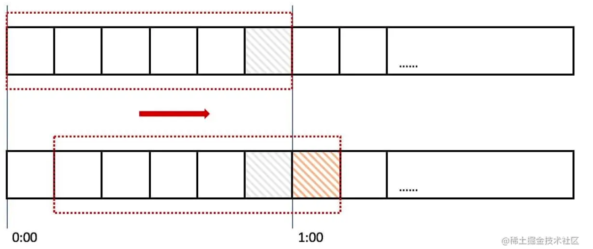

# 常见限流算法

## 1. 计数器

计数器是一种最简单限流算法，其原理就是：`在一段时间间隔内，对请求进行计数，与阀值进行比较判断是否需要限流，一旦到了时间临界点，将计数器清零。`

1. 可以在程序中设置一个变量 `count`，当过来一个请求我就将这个数` +1`，同时记录请求时间。
2. 当下一个请求来的时候判断 `count` 的计数值是否超过设定的频次，以及当前请求的时间和第一次请求时间是否在 `1` 分钟内。
3. 如果在 `1` 分钟内并且超过设定的频次则证明请求过多，后面的请求就拒绝掉。
4. 如果该请求与第一个请求的间隔时间大于计数周期，且 `count` 值还在限流范围内，就重置 `count`。

> 常见使用redis。比如对每秒限流，可以每秒设置一个key（limit-2021-11-20-11:11:11、limit-2021-11-20-11:11:12）。首先获取当前时间拼接一个如上的key。如果key存在且未超过某个阈值就自增，超过阈值就拒绝；如果key不存在就代表这新的一秒没有请求则重置计数。

### Go实现

```go
type Counter struct {
	rate  int           // 计数周期内最多允许的请求数
	begin time.Time     // 计数开始时间
	cycle time.Duration // 计数周期
	count int           // 计数周期内累计收到的请求数
	lock  sync.Mutex
}

func (l *Counter) Allow() bool {
	l.lock.Lock()
	defer l.lock.Unlock()

	if l.count == l.rate-1 {
		now := time.Now()
		if now.Sub(l.begin) >= l.cycle {
			//速度允许范围内， 重置计数器
			l.Reset(now)
			return true
		} else {
			return false
		}
	} else {
		//没有达到速率限制，计数加1
		l.count++
		return true
	}
}

func (l *Counter) Set(r int, cycle time.Duration) {
	l.rate = r
	l.begin = time.Now()
	l.cycle = cycle
	l.count = 0
}

func (l *Counter) Reset(t time.Time) {
	l.begin = t
	l.count = 0
}

func main() {
	var lr Counter
	lr.Set(3, time.Second) // 1s内最多请求3次

	var wg sync.WaitGroup
	wg.Add(10)
	for i := 0; i < 10; i++ {
		go func(i int) {
			if lr.Allow() {
				log.Println("ok:", i)
			} else {
				log.Println("fail:", i)
			}
			wg.Done()
		}(i)
		time.Sleep(200 * time.Millisecond)
	}
	wg.Wait()
}
/* 每秒三个
2021/11/20 16:22:39 ok: 0
2021/11/20 16:22:39 ok: 1
2021/11/20 16:22:39 ok: 2
2021/11/20 16:22:39 fail: 3
2021/11/20 16:22:40 fail: 4
2021/11/20 16:22:40 ok: 5
2021/11/20 16:22:40 ok: 6
2021/11/20 16:22:40 ok: 7
2021/11/20 16:22:41 ok: 8
2021/11/20 16:22:41 fail: 9
*/
```

### 缺点

如果有个需求对于某个接口 `/query` 每分钟最多允许访问 200 次，假设有个用户在第 59 秒的最后几毫秒瞬间发送 200 个请求，当 59 秒结束后 `Counter` 清零了，他在下一秒的时候又发送 200 个请求。那么在 1 秒钟内这个用户发送了 2 倍的请求，这个是符合我们的设计逻辑的，这也是计数器方法的设计缺陷，系统可能会承受恶意用户的大量请求，甚至击穿系统。


## 2. 滑动窗口

`滑动窗口`是针对计数器存在的临界点缺陷，所谓 `滑动窗口（Sliding window）` 是一种流量控制技术，这个词出现在 `TCP` 协议中。`滑动窗口`把固定时间片进行划分，并且随着时间的流逝，进行移动，固定数量的可以移动的格子，进行计数并判断阀值。

### 算法思想



上图中我们用红色的虚线代表一个时间窗口（`一分钟`），每个时间窗口有 `6` 个格子，每个格子是 `10` 秒钟。每过 `10` 秒钟时间窗口向右移动一格，可以看红色箭头的方向。我们为每个格子都设置一个独立的计数器 `Counter`，假如一个请求在 `0:45` 访问了那么我们将第五个格子的计数器 `+1`（也是就是 `0:40~0:50`），在判断限流的时候需要把所有格子的计数加起来和设定的频次进行比较即可。

那么滑动窗口如何解决我们上面遇到的问题呢？来看下面的图：


当用户在`0:59` 秒钟发送了 `200 `个请求就会被第六个格子的计数器记录 `+200`，当下一秒的时候时间窗口向右移动了一个，此时计数器已经记录了该用户发送的 `200` 个请求，所以再发送的话就会触发限流，则拒绝新的请求。

其实计数器就是滑动窗口啊，只不过只有一个格子而已，所以想让限流做的更精确只需要划分更多的格子就可以了，为了更精确我们也不知道到底该设置多少个格子，`格子的数量影响着滑动窗口算法的精度，依然有时间片的概念，无法根本解决临界点问题`。

### 适用场景

与令牌桶一样，有应对突发流量的能力

### Go实现

主要就是实现sliding window算法。可以参考Bilibili开源的kratos框架里circuit breaker用循环列表保存time slot对象的实现，他们这个实现的好处是不用频繁的创建和销毁time slot对象。下面给出一个简单的基本实现：

```go
var winMu map[string]*sync.RWMutex

func init() {
	winMu = make(map[string]*sync.RWMutex)
}

type timeSlot struct {
	timestamp time.Time // 这个timeSlot的时间起点
	count     int       // 落在这个timeSlot内的请求数
}

func countReq(win []*timeSlot) int {
	var count int
	for _, ts := range win {
		count += ts.count
	}
	return count
}

type SlidingWindowLimiter struct {
	SlotDuration time.Duration // time slot的长度
	WinDuration  time.Duration // sliding window的长度
	numSlots     int           // window内最多有多少个slot
	maxReq       int           // win duration内允许的最大请求数
	windows      map[string][]*timeSlot
}

func NewSliding(slotDuration time.Duration, winDuration time.Duration, maxReq int) *SlidingWindowLimiter {
	return &SlidingWindowLimiter{
		SlotDuration: slotDuration,
		WinDuration:  winDuration,
		numSlots:     int(winDuration / slotDuration),
		windows:      make(map[string][]*timeSlot),
		maxReq:       maxReq,
	}
}

// 获取user_id/ip的时间窗口
func (l *SlidingWindowLimiter) getWindow(uidOrIp string) []*timeSlot {
	win, ok := l.windows[uidOrIp]
	if !ok {
		win = make([]*timeSlot, 0, l.numSlots)
	}
	return win
}

func (l *SlidingWindowLimiter) storeWindow(uidOrIp string, win []*timeSlot) {
	l.windows[uidOrIp] = win
}

func (l *SlidingWindowLimiter) validate(uidOrIp string) bool {
	// 同一user_id/ip并发安全
	mu, ok := winMu[uidOrIp]
	if !ok {
		var m sync.RWMutex
		mu = &m
		winMu[uidOrIp] = mu
	}
	mu.Lock()
	defer mu.Unlock()

	win := l.getWindow(uidOrIp)
	now := time.Now()
	
	// 已经过期的time slot移出时间窗
	timeoutOffset := -1
	for i, ts := range win {
		if ts.timestamp.Add(l.WinDuration).After(now) {
			break
		}
		timeoutOffset = i
	}
	if timeoutOffset > -1 {
		win = win[timeoutOffset+1:]
	}

	// 判断请求是否超限
	var result bool
	if countReq(win) < l.maxReq {
		result = true
	}

	// 记录这次的请求数
	var lastSlot *timeSlot
	if len(win) > 0 {
		lastSlot = win[len(win)-1]
		if lastSlot.timestamp.Add(l.SlotDuration).Before(now) {
			lastSlot = &timeSlot{timestamp: now, count: 1}
			win = append(win, lastSlot)
		} else {
			lastSlot.count++
		}
	} else {
		lastSlot = &timeSlot{timestamp: now, count: 1}
		win = append(win, lastSlot)
	}

	l.storeWindow(uidOrIp, win)

	return result
}

func (l *SlidingWindowLimiter) getUidOrIp() string {
	return "127.0.0.1"
}

func (l *SlidingWindowLimiter) IsLimited() bool {
	return !l.validate(l.getUidOrIp())
}

func main() {
	limiter := NewSliding(100*time.Millisecond, time.Second, 10)
	for i := 0; i < 5; i++ {
		fmt.Println(limiter.IsLimited())
	}
	time.Sleep(100 * time.Millisecond)
	for i := 0; i < 5; i++ {
		fmt.Println(limiter.IsLimited())
	}
	fmt.Println(limiter.IsLimited())
	for _, v := range limiter.windows[limiter.getUidOrIp()] {
		fmt.Println(v.timestamp, v.count)
	}

	fmt.Println("a thousand years later...")
	time.Sleep(time.Second)
	for i := 0; i < 7; i++ {
		fmt.Println(limiter.IsLimited())
	}
	for _, v := range limiter.windows[limiter.getUidOrIp()] {
		fmt.Println(v.timestamp, v.count)
	}
}

```


## 3. 漏桶算法

### 算法思想

与令牌桶是“反向”的算法，当有请求到来时先放到木桶中，worker以固定的速度从木桶中取出请求进行相应。如果木桶已经满了，直接返回请求频率超限的错误码或者页面

### 特点

漏桶算法有以下特点：

- 漏桶具有固定容量，出水速率是固定常量（流出请求）
- 如果桶是空的，则不需流出水滴
- 可以以任意速率流入水滴到漏桶（流入请求）
- 如果流入水滴超出了桶的容量，则流入的水滴溢出（新请求被拒绝）

漏桶限制的是**常量流出速率**（即流出速率是一个固定常量值），所以最大的速率就是出水的速率，**不能出现突发流量**。

### 适用场景

流量最均匀的限流方式，一般用于流量“整形”，例如**保护数据库的限流**。先把对数据库的访问加入到木桶中，worker再以db能够承受的qps从木桶中取出请求，去访问数据库。不太适合电商抢购和微博出现热点事件等场景的限流，一是应对突发流量不是很灵活，二是为每个user_id/ip维护一个队列(木桶)，workder从这些队列中拉取任务，资源的消耗会比较大。

### Go实现

通常使用队列来实现，在go语言中可以通过buffered channel来快速实现，任务加入channel，开启一定数量的 worker 从 channel 中获取任务执行。

```go
// 封装业务逻辑的执行结果
type Result struct {
	Msg string
}

// 执行的业务逻辑函数
type Handler func() Result

// 每个请求来了，把需要执行的业务逻辑封装成Task，放入木桶，等待worker取出执行
type Task struct {
	handler Handler     // worker从木桶中取出请求对象后要执行的业务逻辑函数
	resChan chan Result // 等待worker执行并返回结果的channel
	taskID  int
}

func NewTask(id int, handler Handler) Task {
	return Task{
		handler: handler,
		resChan: make(chan Result),
		taskID:  id,
	}
}

// 漏桶
type LeakyBucket struct {
	BucketSize int       // 木桶的大小
	WorkerNum  int       // 同时从木桶中获取任务执行的worker数量
	bucket     chan Task // 存方任务的木桶
}

func NewLeakyBucket(bucketSize int, workNum int) *LeakyBucket {
	return &LeakyBucket{
		BucketSize: bucketSize,
		WorkerNum:  workNum,
		bucket:     make(chan Task, bucketSize),
	}
}

func (b *LeakyBucket) AddTask(task Task) bool {
	// 如果木桶已经满了，返回false
	select {
	case b.bucket <- task:
	default:
		fmt.Printf("request[id=%d] is refused\n", task.taskID)
		return false
	}

	// 如果成功入桶，调用者会等待worker执行结果
	resp := <-task.resChan
	fmt.Printf("request[id=%d] is run ok, resp[%v]\n", task.taskID, resp)
	return true
}

func (b *LeakyBucket) Start(ctx context.Context) {
	// 开启worker从木桶拉取任务执行
	for i := 0; i < b.WorkerNum; i++ {
		go func(ctx context.Context) {
			for {
				select {
				case <-ctx.Done():
					return
				default:
					task := <-b.bucket
					result := task.handler()
					task.resChan <- result
				}
			}
		}(ctx)
	}
}

func main() {
	bucket := NewLeakyBucket(10, 4)
	ctx, cancel := context.WithCancel(context.Background())
	defer cancel()

	bucket.Start(ctx) // 开启消费者

  	// 模拟20个并发请求
	var wg sync.WaitGroup
	wg.Add(20)
	for i := 0; i < 20; i++ {
		go func(id int) {
			defer wg.Done()
			task := NewTask(id, func() Result {
				time.Sleep(300 * time.Millisecond)
				return Result{}
			})
			bucket.AddTask(task)
		}(i)
	}
	wg.Wait()
	time.Sleep(10 * time.Second)
}

```


## 4. 令牌桶算法

### 算法思想

令牌桶算法`（Token Bucket）`是网络流量整形`（Traffic Shaping）`和速率限制`（Rate Limiting）`中最常使用的一种算法。典型情况下，令牌桶算法用来控制发送到网络上的数据的数目，并允许突发数据的发送。想象有一个木桶，以固定的速度往木桶里加入令牌，木桶满了则不再加入令牌。服务收到请求时尝试从木桶中取出一个令牌，如果能够得到令牌则继续执行后续的业务逻辑；如果没有得到令牌，直接返回反问频率超限的错误码或页面等，不继续执行后续的业务逻辑


### 特点

由于木桶内只要有令牌，请求就可以被处理，所以令牌桶算法可以支持突发流量。同时由于往木桶添加令牌的速度是固定的，且木桶的容量有上限，所以单位时间内处理的请求数目也能够得到控制，起到限流的目的。假设加入令牌的速度为 1token/10ms，桶的容量为500，在请求比较的少的时候（小于每10毫秒1个请求）时，木桶可以先"攒"一些令牌（最多500个）。当有突发流量时，一下把木桶内的令牌取空，也就是有500个在并发执行的业务逻辑，之后要等每10ms补充一个新的令牌才能接收一个新的请求。

木桶的容量 - 考虑业务逻辑的资源消耗和机器能承载并发处理多少业务逻辑。生成令牌的速度 - 太慢的话起不到“攒”令牌应对突发流量的效果。

- 令牌按固定的速率被放入令牌桶中
- 桶中最多存放 `B` 个令牌，当桶满时，新添加的令牌被丢弃或拒绝
- 如果桶中的令牌不足 `N` 个，则不会删除令牌，且请求将被限流（丢弃或阻塞等待）

令牌桶限制的是平均流入速率（允许突发请求，只要有令牌就可以处理，支持一次拿3个令牌，4个令牌...），并允许一定程度突发流量。


### 适用场景

适合电商抢购或者微博出现热点事件这种场景，因为在限流的同时可以应对一定的突发流量。如果采用均匀速度处理请求的算法，在发生热点时间的时候，会造成大量的用户无法访问，对用户体验的损害比较大。


### Go实现

假设每100ms生产一个令牌，按user_id/IP记录访问最近一次访问的时间戳 t_last 和令牌数，每次请求时如果 now - last > 100ms, 增加 (now - last) / 100ms个令牌。然后，如果令牌数 > 0，令牌数 -1 继续执行后续的业务逻辑，否则返回请求频率超限的错误码或页面。


```go
type TokenBucket struct {
	lock sync.Mutex

	rate     time.Duration // 多长时间生成一个令牌
	capacity int           // 桶的容量
	tokens   int           // 桶中当前token数量
	last     time.Time     // 桶上次放token的时间戳 s
}

func NewTokenBucket(bucketSize int, tokenRate time.Duration) *TokenBucket {
	return &TokenBucket{
		capacity: bucketSize,
		rate:     tokenRate,
	}
}

// 验证是否能获取一个令牌 返回是否被限流
func (t *TokenBucket) Allow() bool {
	t.lock.Lock()
	defer t.lock.Unlock()

	now := time.Now()
	if t.last.IsZero() {
		// 第一次访问初始化为最大令牌数
		t.last, t.tokens = now, t.capacity
	} else {
		if t.last.Add(t.rate).Before(now) {
			// 如果 now 与上次请求的间隔超过了 token rate
			// 则增加令牌，更新last
			t.tokens += int(now.Sub(t.last) / t.rate)
			if t.tokens > t.capacity {
				t.tokens = t.capacity
			}
			t.last = now
		}
	}

	if t.tokens > 0 {
		// 如果令牌数大于0，取走一个令牌
		t.tokens--
		return true
	}

	// 没有令牌,则拒绝
	return false
}

func main() {
	tokenBucket := NewTokenBucket(5, 100*time.Millisecond)
	for i := 0; i < 10; i++ {
		fmt.Println(tokenBucket.Allow())
	}
	time.Sleep(100 * time.Millisecond)
	fmt.Println(tokenBucket.Allow())
}

```


